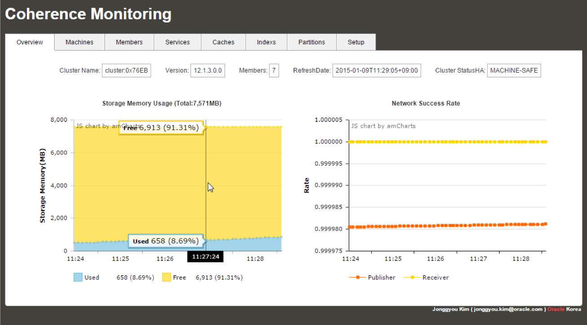

# oracle-coherence-web-monitoring

## screenshot



## Step 1.
>Download jolokia-jvm.jar at http://search.maven.org/remotecontent?filepath=org/jolokia/jolokia-jvm/1.3.3/jolokia-jvm-1.3.3-agent.jar

## Step 2.
>Download amcharts at https://www.amcharts.com/downloads/javascript-charts/ and extract it.
  
## Step 3.
>run script

```
java -javaagent:jolokia-jvm.jar=port=8778,host=localhost -Dtangosol.coherence.management=all -Dcom.sun.management.jmxremote.ssl=false -Dcom.sun.management.jmxremote.authenticate=false -cp ..\lib\coherence.jar com.tangosol.net.management.MBeanConnector –rmi
```

## Step 4.
>Open coherence.html in browser.

## Step 5.
>In Setting tab in browser, modify Jolokia URL for your environments. 

